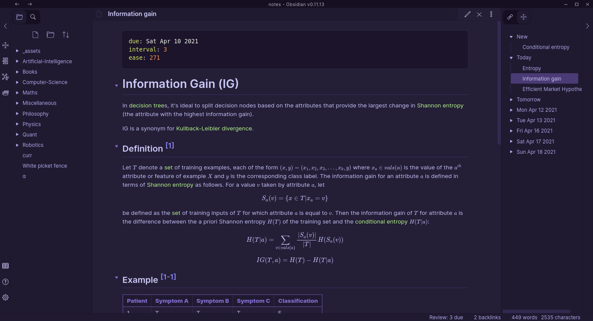

# Concepts Review Obsidian Plugin

Version 0.5.1

## "Philosophy"

- Notes should be atomic i.e. focus on a single concept.
- Notes should be highly linked.
- Reviews should start only after properly understanding a concept.
- Reviews should be [Feynman-technique](https://fs.blog/2021/02/feynman-learning-technique/)-esque.

## Guide



### Reviewing

#### New Notes

All "new" notes with content are listed under `New` on the right pane (Review Queue). To review, click on the file to open it, then choose either the `Review: Easy` or `Review: Hard` option on the file menu. The notes will then scheduled appropriately.

The file menu can found on the `More options` three dots menu or by right clicking on the file on the file manager (left pane).

#### Scheduled notes

`Review: N due` on the status bar at the bottom of the screen shows how many notes one has to review today. Clicking on that opens one of the notes for review. Alternatively, one can use the `Open a note for review` command.

### Settings

Available settings are:
- Choosing whether to open a note by random or the most important note
- Choosing whether to open the next note automatically after reviewing another

### Ignoring some notes

Click the `Review: Ignore file` option on the file menu or add the following frontmatter to the very top of the note:
```yaml
---
review: false
---
```

### Right Pane (Review Queue)

- Daily review entries are sorted by importance (PageRank)

## Spaced Repetition Algorithm

- Spaced repetition? [Basics](https://ncase.me/remember/), [Detailed](https://www.gwern.net/Spaced-repetition).
- The algorithm is a variant of [Anki's algorithm](https://faqs.ankiweb.net/what-spaced-repetition-algorithm.html) which is based on the [SM-2 algorithm](https://www.supermemo.com/en/archives1990-2015/english/ol/sm2).
- It supports binary reviews i.e. a concept is either hard or easy at the time of review.
- initial ease is weighted (using max_link_factor) depending on the average ease of linked notes, note importance, and the base ease.
  - `if link_count > 0: initial_ease = (1 - link_contribution) * base_ease + link_contribution * average_ease`
    - `link_contribution = max_link_factor * min(1.0, log(link_count + 0.5) / log(64))` (cater for uncertainty by slowly increasing link_contribution by `log(number of links)`)
  - The importance of the difference concepts/notes is determined using the PageRank algorithm (not all notes are created equal xD)
    - On most occasions, the most fundamental concepts/notes have higher importance
- If the user reviews a concept/note as:
  - easy, the ease increases by `20` and the interval changes to `old_interval * new_ease / 100`
  - hard, the ease decreases by `20` and the interval changes to `old_interval * 0.5`
    - The `0.5` can be modified in settings
    - `minimum ease = 130`
  - For `8` or more days:
    - `interval += random_choice({-fuzz, 0, +fuzz})`
      - where `fuzz = ceil(0.05 * interval)`
      - [Anki docs]((https://faqs.ankiweb.net/what-spaced-repetition-algorithm.html)):
        > "[...] Anki also applies a small amount of random “fuzz” to prevent cards that were introduced at the same time and given the same ratings from sticking together and always coming up for review on the same day."
- The scheduling information is stored in YAML front matter
