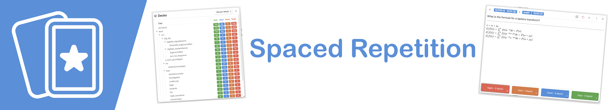
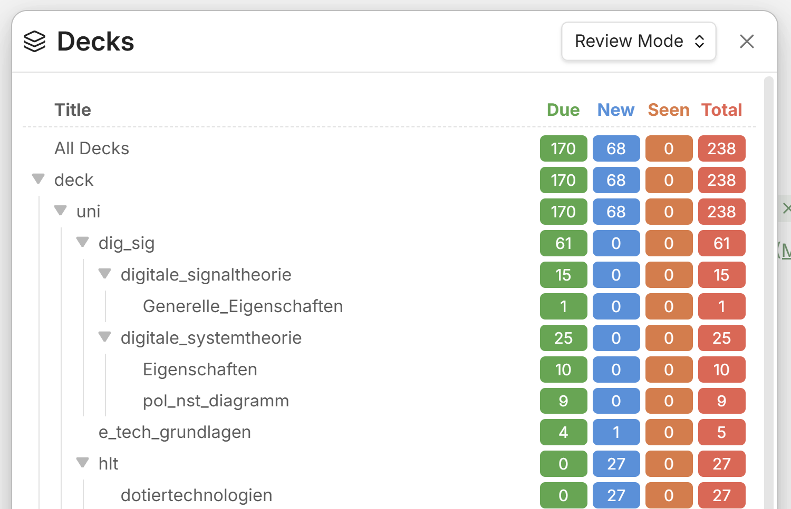
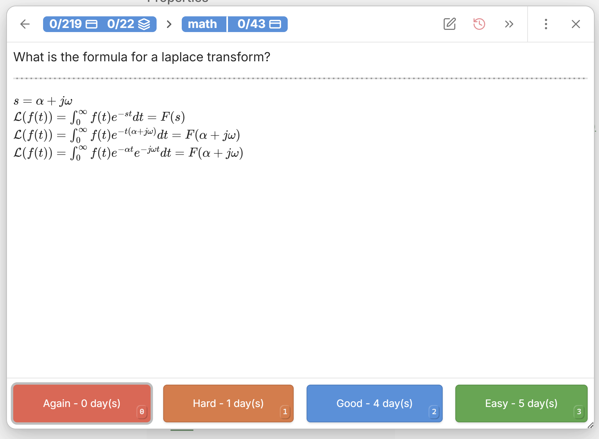

# Obsidian Spaced Repetition Plugin



   

Fight the forgetting curve by reviewing flashcards & notes using [spaced repetition](https://en.wikipedia.org/wiki/Spaced_repetition).

- For more information on how to use the plugin, check either the TL;DR on this page or the [documentation](https://stephenmwangi.com/obsidian-spaced-repetition/).
- Raise an [issue](https://github.com/st3v3nmw/obsidian-spaced-repetition/issues/) if you have a feature request or a bug report.
- Visit the [discussions](https://github.com/st3v3nmw/obsidian-spaced-repetition/discussions/) section for Q&A help, feedback, and general discussion.
- The plugin has been translated into _Arabic, Chinese, Czech, Dutch, French, German, Italian, Korean, Japanese, Polish, Portuguese, Spanish, Russian, Turkish, and Ukrainian_ by the Obsidian community 😄.
    - To help translate this plugin to your language, check the [translation guide here](https://stephenmwangi.com/obsidian-spaced-repetition/contributing/#translating_1).

<br/>

## Features⚡

#### Reviewing Flashcards🗃️

- [Getting started](https://stephenmwangi.com/obsidian-spaced-repetition/flashcards/flashcards-overview/) (Using Obsidian's hierarchical tags or folder structure)
- Creating Flashcards
    - [Single-line style](https://stephenmwangi.com/obsidian-spaced-repetition/flashcards/q-and-a-cards/#single-line-basic) (`Question::Answer`)
    - [Single-line reversed style](https://stephenmwangi.com/obsidian-spaced-repetition/flashcards/q-and-a-cards/#single-line-bidirectional) (`Question:::Answer`)
    - [Multi-line style](https://stephenmwangi.com/obsidian-spaced-repetition/flashcards/q-and-a-cards/#multi-line-basic) (Separated by `?`)
    - [Multi-line reversed style](https://stephenmwangi.com/obsidian-spaced-repetition/flashcards/q-and-a-cards/#multi-line-bidirectional) (Separated by `??`)
    - [Cloze cards](https://stephenmwangi.com/obsidian-spaced-repetition/flashcards/cloze-cards/) (`==highlight==` your cloze deletions!, `**bolded text**`, `{{text in curly braces}}`, or use custom cloze patterns)
    - Rich text support in flashcards (inherited from Obsidian)
        - Images, Audio, & Video
        - LaTeX
        - Code syntax highlighting
        - Footnotes
- [Organize Decks](https://stephenmwangi.com/obsidian-spaced-repetition/flashcards/decks/) (Using Obsidian's hierarchical tags or folder structure)
- [Card context - automatic titles based on headings](https://stephenmwangi.com/obsidian-spaced-repetition/flashcards/reviewing/#context) (i.e. `Note title > Heading 1 > Subheading`)

#### Reviewing Notes📄

- [Getting started](https://stephenmwangi.com/obsidian-spaced-repetition/notes/)
- [Due Notes for review](https://stephenmwangi.com/obsidian-spaced-repetition/notes/#note-review-queue)
- [How to review a note](https://stephenmwangi.com/obsidian-spaced-repetition/notes/#reviewing)

#### [Statistics📈](https://stephenmwangi.com/obsidian-spaced-repetition/flashcards/statistics/)

<br/>
<br/>

## Usage TL;DR🚀

### Creating Decks

1. Add the tag `#flashcards` in a note, where you want to write your cards
2. If you want to have your cards in a specific sub deck, then add your sub deck name to the tag like so: `#flashcards/YOUR_SUB_DECK_NAME`
3. Write your card in the note which where you've added your tag

<br/>

### Creating Cards

##### 1. Decide what card type you need:

- Single line -> Card format:
  `Question::Answer`
- Single line reversable -> Card format:
  `Question:::Answer`
- Multi line -> Card format:
    ```
    Question
    ?
    Answer
    ```
- Multi line reversable -> Card format:
    ```
    Question
    ??
    Answer
    ```

##### 2. Write your card (In one of those formats) in a note that you have tagged as a deck

<br/>

### Reviewing Cards

##### 1.1. Open the list of all decks with either of two commands(ctrl+p):

- _Review Flashcards from all notes_
  -> Here the algorithm decides based on your past reviews, which cards are due to review
- _Select a deck to cram_
  -> All decks and all cards are reviewable and the algorithm is fully ignored

##### 1.2. Or open the list of all decks within your currently opened note(ctrl+p):

- _Review flashcards in this note_
  -> Here the algorithm decides based on your past reviews, which cards from this note are due to review
- _Cram flashcards in this note_
  -> All decks and all cards from this note are reviewable and the algorithm is fully ignored



##### 2. Select a deck via the list and click on the deck name

##### 3. Rate your ability to remember the answer to the current question

- This tells the algorithm what you know well and what you don't



<br/>

### Creating & reviewing whole notes

Sometimes it makes more sense to recall a whole note, when it isn't just pure facts which you have to learn.
This is where marking a note for review comes in handy.

1. Just like with decks add the tag `#review` to your note to mark them as reviewable
2. To see which notes are due for review open the note review queue via the command(ctrl+p): _Open Notes Review Queue in sidebar_
3. There you can open up the notes for review, just as if you would open them up in your file explorer, only that they are sorted her by when they are due for review
4. Once you have recalled/reviewed your note you can rate your recall ability by executing the command(ctrl+p, or just via the 3 dots next to the note): _Review note as YOUR_RATING_ - The algorithm will take your rating into account to calculate a new due date, when you have to review it again
   <br/>

## Links & Resources🔗

- [Documentation](https://stephenmwangi.com/obsidian-spaced-repetition/).
- [Roadmap](https://github.com/st3v3nmw/obsidian-spaced-repetition/projects/3/)
- [Dev News](https://github.com/st3v3nmw/obsidian-spaced-repetition/discussions/categories/development-news)
- [Issues](https://github.com/st3v3nmw/obsidian-spaced-repetition/issues/)
- [Discussions](https://github.com/st3v3nmw/obsidian-spaced-repetition/discussions/)

<br/>

## Support Development💻

<table>
    <thead>
        <tr>
            <th>Stephen Mwangi (Owner)</th>
            <th>Kyle Klus (Maintainer)</th>
        </tr>
    </thead>
    <tbody>
  <tr>
    <td align="center">
        <a href='https://ko-fi.com/M4M44DEN6' target='_blank'>
            
        </a>
    </td>
    <td align="center">
      <a href="https://github.com/KyleKlus">
        
      </a>
    </td>
  </tr>
    </tbody>
</table>
